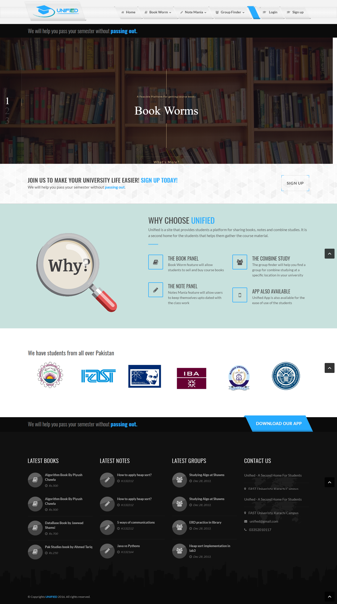
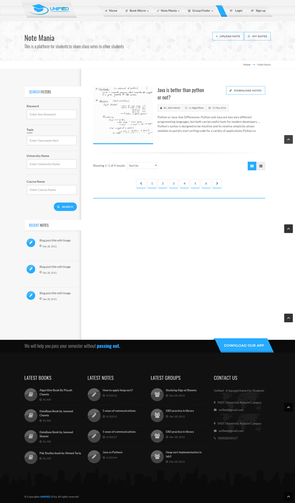

# Unified
A web application created for students to help them in exchanging books and notes. Also, to allow them to find people for group study.

The folder contains several files related to HTML, CSS and JavaScript.
The backend is handled using firebase.
The project contains three main features:
1)Book Worm
It is a feature that is provided for student who want to buy books from their seniors, and for those seniors who want to sell their unused and old books to their juniors.
2)Group Finder
It is a feature that helps you in finding a group of people for group study. It has specific locations 	situated of different universities that you could tag and mention the course/topic you are 		studying allowing others to join you.   
3)Notes Mania
It is a feature that provides a platform for sharing class notes for students who have missed the 	class.

Note: Extract Images.zip and Revolution.zip before testing the project.
Below is a glimpse of the web:

